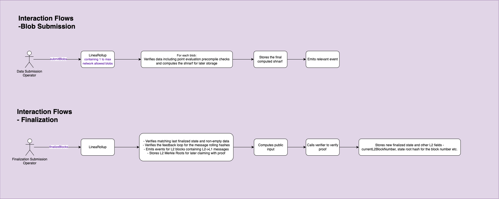

# Blob Submission & Finalization

This document outlines the core data and finalization flows involved in LineaRollup's lifecycle, including blob commitment and zk-proof-based finality (ABI `"9.0"`).

---

## Blob Submission

This flow is used by the **Data Submission Operator** to submit blobs to the LineaRollup system.

### Steps

1. **Data Submission Operator** calls `submitBlobs(bytes32[] blobFinalBlockHashes, parentShnarf, finalBlobShnarf)` on the `LineaRollup` contract with **1 to N** final L2 block hashes (one per EIP-4844 blob in the transaction), where **N = network maximum**.
2. For each submitted blob index `i`:
   - The contract reads `blobhash(i)` as the data hash.
   - Computes `shnarf = keccak256(parentShnarf, blobFinalBlockHashes[i], blobhash(i))`.
   - Chains continuity from the parent shnarf.
3. The final computed `shnarf` must equal `_finalBlobShnarf` and is stored.
4. `DataSubmittedV4(parentShnarf, shnarf, finalBlockHash)` is emitted for the last blob in the batch.

Calldata DA (test harness / Validium-style acceptors) uses `submitDataAsCalldata` with `CompressedCalldataSubmissionV2 { blockHash, compressedData }` and the same 3-field shnarf, where `dataHash = keccak256(compressedData)`.

**Note:** L1 no longer runs the EIP-4844 point-evaluation precompile for shnarf acceptance. Blob DA still requires a blob-carrying transaction so `blobhash(i)` is non-zero.

**Note:** `Shnarf` denotes a generic and iterative hashing structure for a sequence of values. It is somewhat analog to a stack and supports efficient `proof of append` and `proof of pop`. The structure is similar to how block hashes are computed: for appends, `newShnarf = H(oldShnarf || appendedValue)`. In Linea ABI 9.0, appends use `H(parentShnarf || finalBlockHash || dataHash)`.

---

## Finalization Submission

This flow finalizes 1 or more aggregated blob transaction submissions by verifying correct execution proven via zero-knowledge proofs.

### Steps

1. **Finalization Submission Operator** calls `finalizeBlocks(aggregatedProof, proofType, FinalizationDataV5)`.
2. `LineaRollup` contract:
   - Validates guest-program `verifierKeys` against the on-chain allowlist.
   - Continuity:
     - If `blockHashes[lastFinalized]` is empty → **migration path**: require matching `parentStateRootHash` from legacy `stateRootHashes`, and `parentBlockHash == 0`.
     - Else → **new path**: soft check that caller-declared `parentBlockHash` matches `blockHashes[lastFinalized]`.
   - Validates the messaging rolling hash feedback loop preventing manipulation or censorship.
   - Requires `finalShnarf = keccak256(parentShnarf, finalBlockHash, finalBlobHash)` was previously submitted.
   - Emits events for L2 blocks containing L2 → L1 messages.
   - Stores **Merkle roots** of L2 messages for proof-based claiming.
3. Computes the **public input** (includes `keccak256(verifierKeys)`).
4. Calls the Plonk-based **Verifier** to validate the provided zk-proof.
5. Upon success, updates finalized state:
   - Anchors `blockHashes[endBlockNumber] = finalBlockHash`
   - Updates `currentL2BlockNumber`, `currentFinalizedShnarf`, and `currentFinalizedState`
   - Emits `DataFinalizedV4`

---

### Verifier Contract

The verifier contract is an advanced zero-knowledge proof verifier specifically tailored for the PLONK protocol on Ethereum mainnet. It verifies zk-SNARK proofs generated using [gnark](https://github.com/Consensys/gnark), ensuring that a given proof corresponds to a valid computation without revealing inputs. The contract is written almost entirely in inline Yul assembly for gas efficiency and precision, and it uses elliptic curve operations, pairings, and the Fiat-Shamir heuristic to validate a serialized proof against public inputs. This is critical infrastructure for trustless, privacy-preserving applications such as rollups, where it ensures the integrity of off-chain computations before accepting their results on-chain.

---

