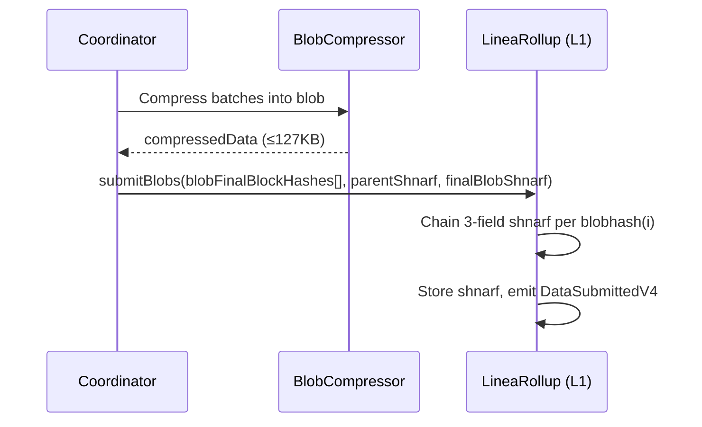
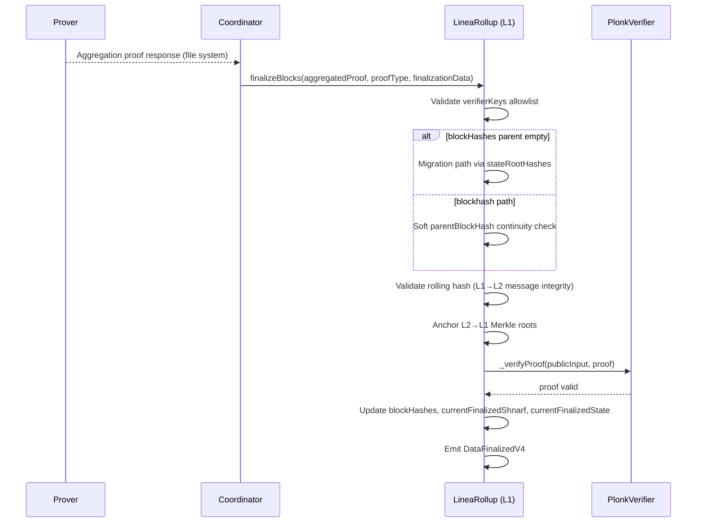

# Rollup

> LineaRollup contracts, data submission, and ZK finalization — the full L1 settlement pipeline.

## Overview

Linea operates as a zk-rollup where L2 state transitions are posted to and verified on Ethereum L1. The pipeline has three phases:

1. **Submission** — Compressed L2 block data posted to L1 via EIP-4844 blobs or calldata.
2. **Shnarf chaining** — Each submission extends a rolling commitment (`shnarf`) linking all prior submissions.
3. **Finalization** — An aggregated ZK proof verifies state transitions on-chain, updating the finalized state.

ABI string: `CONTRACT_VERSION()` returns `"9.0"`. Continuity is anchored on `blockHashes[blockNumber]` (with a one-way migration from legacy `stateRootHashes` on upgraded proxies).

Two contract variants exist:

- **LineaRollup** — Full rollup with EIP-4844 blob DA. Inherits L1 messaging, yield management, and liveness recovery.
- **Validium** — Calldata-only shnarf submission. Lighter footprint, weaker DA guarantees.

Both share `LineaRollupBase` for finalization logic, verifier management, and shnarf computation.

## Components

| Component | Path | Role |
|-----------|------|------|
| LineaRollup | `contracts/src/rollup/LineaRollup.sol` | Main L1 rollup contract |
| LineaRollupBase | `contracts/src/rollup/LineaRollupBase.sol` | Shared finalization, verifier, shnarf logic |
| Validium | `contracts/src/rollup/Validium.sol` | Calldata-only DA variant |
| LivenessRecovery | `contracts/src/rollup/LivenessRecovery.sol` | Emergency operator recovery after 6-month inactivity |
| Eip4844BlobAcceptor | `contracts/src/rollup/dataAvailability/Eip4844BlobAcceptor.sol` | EIP-4844 blob submission (final block hashes per blob) |
| CalldataBlobAcceptor | `contracts/src/rollup/dataAvailability/CalldataBlobAcceptor.sol` | Calldata compressed-data submission |
| ShnarfDataAcceptor | `contracts/src/rollup/dataAvailability/ShnarfDataAcceptor.sol` | Validium shnarf submission |
| PlonkVerifierForDataAggregation | `contracts/src/verifiers/PlonkVerifierForDataAggregation.sol` | Aggregation proof verification |
| BlobSubmissionCoordinator | `coordinator/ethereum/blob-submitter/` | Periodic blob submission to L1 |
| AggregationFinalizationCoordinator | `coordinator/ethereum/blob-submitter/` | Schedules finalization after aggregation proof |
| Blob Compressor | `jvm-libs/linea/blob-compressor/` | Go native library for block compression |
| Shnarf Calculator | `jvm-libs/linea/blob-shnarf-calculator/` | Go native library for shnarf computation (coordinator still on the pre-9.0 formula until stack cutover) |

## Inheritance

```
LineaRollup
  ├── LineaRollupBase
  │     ├── PauseManager, RateLimiter, PermissionsManager
  │     └── L1MessageService
  ├── LineaRollupYieldExtension
  ├── LivenessRecovery
  ├── Eip4844BlobAcceptor
  └── ClaimMessageV1

Validium
  ├── LineaRollupBase
  ├── LocalShnarfProvider
  └── ShnarfDataAcceptor
```

## Key State and Roles

| Variable | Type | Description |
|----------|------|-------------|
| `blockHashes` | `mapping(uint256 => bytes32)` | Authoritative L2 block hash per finalized block number |
| `stateRootHashes` | `mapping(uint256 => bytes32)` | Legacy continuity (migration path only when `blockHashes[last]` is empty) |
| `currentFinalizedShnarf` | `bytes32` | Latest finalized shnarf hash |
| `currentFinalizedState` | `bytes32` | Composite of last message number, rolling hash, forced-tx fields, timestamp |
| `verifierKeys` | `mapping(bytes32 => bool)` | Allowed guest-program verifier keys |
| `livenessRecoveryOperator` | `address` | Emergency recovery operator address |

| Role | Purpose |
|------|---------|
| `OPERATOR_ROLE` | Submit blobs, finalize blocks |
| `VERIFIER_SETTER_ROLE` / `VERIFIER_UNSETTER_ROLE` | Manage verifier contract addresses |
| `SET_VERIFIER_KEY_ROLE` / `UNSET_VERIFIER_KEY_ROLE` | Manage guest-program verifier keys |
| `DEFAULT_ADMIN_ROLE` | Grant/revoke roles |

---

## Data Submission

The coordinator compresses batches of L2 blocks into blobs and submits them to LineaRollup on L1. On-chain blob acceptance no longer verifies KZG commitments via the point-evaluation precompile; operators supply the final L2 block hash per blob and the expected shnarf chain.

### Submission Flow



### Contract Interface

```solidity
function submitBlobs(
    bytes32[] calldata _blobFinalBlockHashes,
    bytes32 _parentShnarf,
    bytes32 _finalBlobShnarf
) external;

function submitDataAsCalldata(
    CompressedCalldataSubmissionV2 calldata _submission,
    bytes32 _parentShnarf,
    bytes32 _expectedShnarf
) external;

struct CompressedCalldataSubmissionV2 {
    bytes32 blockHash;
    bytes compressedData;
}
```

For EIP-4844 submissions, `dataHash` in the shnarf formula is `blobhash(i)`. For calldata, it is `keccak256(compressedData)`.

### Shnarf Computation

The shnarf is a rolling commitment linking consecutive submissions:

```
shnarf = keccak256(parentShnarf, finalBlockHash, dataHash)
```

Genesis shnarf at init: `keccak256(EMPTY, initialBlockHash, EMPTY)`.

Legacy 5-field `_computeShnarf(parent, snarkHash, finalStateRootHash, evalPoint, evalClaim)` remains as an unused-by-finalization overload for transition helpers only.

### Blob Structure

Blobs pack arbitrary data into BLS12-381 scalar field elements (254 usable bits per 32-byte chunk):

```
Header:
  version      uint16   // currently 0xffff
  dictChecksum [32]byte
  nbBatches    uint16
  batchNbBytes []uint24 // per-batch size

Payload:
  compress header (version uint16, bypassed uint8)
  RLP-encoded blocks (boundary from header)
```

Padding uses `0xFF000000...` to fill to exactly 127 KB (130,047 bytes usable).

### Coordinator Blob Grouping

`BlobsGrouperForSubmission` chunks blobs into groups of up to 6 for multi-blob transactions. `L1ShnarfBasedAlreadySubmittedBlobsFilter` skips blobs already on-chain. `ContractUpgradeSubmissionLatchFilter` blocks submission during contract upgrades.

---

## Finalization

Finalization posts an aggregated ZK proof to LineaRollup, proving that a range of L2 blocks were executed correctly.

### Finalization Flow



### Contract Interface

```solidity
function finalizeBlocks(
    bytes calldata _aggregatedProof,
    uint256 _proofType,
    FinalizationDataV5 calldata _finalizationData
) external whenTypeAndGeneralNotPaused(PauseType.FINALIZATION) onlyRole(OPERATOR_ROLE);

struct FinalizationDataV5 {
    bytes32 parentStateRootHash;       // migration path only
    bytes32 parentBlockHash;           // soft continuity on new path
    uint256 endBlockNumber;
    ShnarfData shnarfData;             // V5 uses parentShnarf; other fields are padding
    uint256 lastFinalizedTimestamp;
    uint256 finalTimestamp;
    bytes32 lastFinalizedL1RollingHash;
    bytes32 l1RollingHash;
    uint256 lastFinalizedL1RollingHashMessageNumber;
    uint256 l1RollingHashMessageNumber;
    uint256 l2MerkleTreesDepth;
    uint256 lastFinalizedForcedTransactionNumber;
    uint256 finalForcedTransactionNumber;
    bytes32 lastFinalizedForcedTransactionRollingHash;
    bytes32 finalBlockHash;
    bytes32 finalBlobHash;
    bytes32[] l2MerkleRoots;
    address[] filteredAddresses;
    bytes32[] verifierKeys;
    bytes l2MessagingBlocksOffsets;
}
```

Final shnarf at finalize: `keccak256(shnarfData.parentShnarf, finalBlockHash, finalBlobHash)`. Must already exist via prior submission.

### Public Input Computation

The verifier receives a single `uint256` public input derived from `_computePublicInput` in `LineaRollupBase` (field order abbreviated):

```
keccak256(
    lastFinalizedShnarf, finalShnarf,
    finalTimestamp, endBlockNumber,
    lastFinalizedL1RollingHash, l1RollingHash,
    lastFinalizedL1RollingHashMessageNumber, l1RollingHashMessageNumber,
    lastFinalizedForcedTransactionRollingHash, finalForcedTransactionRollingHash,
    lastFinalizedForcedTransactionNumber, finalForcedTransactionNumber,
    l2MerkleTreesDepth, keccak256(l2MerkleRoots),
    verifierChainConfiguration,
    keccak256(filteredAddresses),
    keccak256(verifierKeys)
) mod MODULO_R
```

`MODULO_R` is the BN254 scalar field order. `verifierChainConfiguration` comes from `IPlonkVerifier.getChainConfiguration()`. Guest-program `verifierKeys` used in the batch must be present in the on-chain allowlist.

### Rolling Hash Validation

Finalization verifies that the L1→L2 rolling hash stored on L2 matches the expected value on L1, guaranteeing no censored or fabricated messages and preserved ordering.

### Proof System

The aggregation proof recursively verifies N execution proofs and M compression proofs:

- **BLS12-377** — Execution and compression proofs
- **BW6** — Intermediate recursion (2-chain with BLS12-377)
- **BN254** — Final proof, verifiable on Ethereum via `ecPairing` precompile

### Errors

| Error | Condition |
|-------|-----------|
| `FinalShnarfNotSubmitted` | Finalization references a shnarf not yet submitted |
| `FinalizationStateIncorrect` | Parent state does not match current finalized state |
| `FinalizationInTheFuture` | Final timestamp exceeds current block timestamp |
| `InvalidProof` | Proof verification failed |
| `StartingRootHashDoesNotMatch` | Migration path: parent state root mismatch |
| `StartingBlockHashDoesNotMatch` | Soft continuity: declared `parentBlockHash` mismatch |
| `VerifierKeyNotFound` | Finalization uses a verifier key not in the allowlist |
| `FinalizationBlockHashIsZeroHash` | `finalBlockHash` is zero |

---

## Liveness Recovery

If no finalization occurs for `SIX_MONTHS_IN_SECONDS` (182 days, due to Solidity integer division `365 / 2`), any caller can invoke `setLivenessRecoveryOperator()` to grant `OPERATOR_ROLE` to the pre-configured recovery operator. This prevents permanent lock-up of bridged funds.

## Events

| Event | Description |
|-------|-------------|
| `DataSubmittedV4` | Blob/calldata accepted (`parentShnarf`, indexed `shnarf`, `finalBlockHash`) |
| `DataFinalizedV4` | Blocks finalized (`start`/`end`, indexed `shnarf`, `parentBlockHash`, `finalBlockHash`) |
| `VerifierAddressChanged` | Verifier contract updated |
| `VerifierKeysSet` / `VerifierKeysUnset` | Guest-program verifier key allowlist changed |
| `LineaRollupVersionChanged` | ABI string bump recorded on upgrade |

## Test Coverage

| Test File | Runner | Validates |
|-----------|--------|-----------|
| `contracts/test/hardhat/rollup/LineaRollup.ts` | Hardhat | Init, roles, pause, V10 reinit, verifier-key admin |
| `contracts/test/hardhat/rollup/LineaRollup/CalldataSubmission.ts` | Hardhat | V2 calldata submit, `DataSubmittedV4` |
| `contracts/test/hardhat/rollup/LineaRollup/BlobSubmission.ts` | Hardhat | Hash-array blob submit, shnarf continuity errors |
| `contracts/test/hardhat/rollup/LineaRollup/Finalization.ts` | Hardhat | V5 finalization, events, error cases |
| `contracts/test/hardhat/rollup/LineaRollup/FinalizationMigration.ts` | Hardhat | `stateRootHashes` → `blockHashes` migration + soft continuity |
| `contracts/test/hardhat/rollup/Validium.ts` | Hardhat | Validium-specific behavior |
| `contracts/test/hardhat/verifiers/PlonkVerifierForDataAggregation.ts` | Hardhat | Verifier contract correctness |
| `contracts/test/foundry/LineaRollup.t.sol` | Foundry | V2 submit, 3-field shnarf, blockhash finalize |
| `e2e/src/submission-finalization.spec.ts` | Jest | End-to-end submission and finalization (stack still on prior ABI until cutover) |
| `e2e/src/restart.spec.ts` | Jest | Finalization resumes after coordinator restart |

## Related Documentation

- [Architecture: Coordinator](../architecture-description.md#coordinator)
- [Architecture: Blob Compressor](../architecture-description.md#blob-compressor)
- [Architecture: Provers](../architecture-description.md#provers)
- [Tech: Contracts Component](../tech/components/contracts.md) — Contract addresses, directory structure, deployment details
- [Workflow: LineaRollup](../../contracts/docs/workflows/LineaRollup.md)
- [Workflow: Blob Submission and Finalization](../../contracts/docs/workflows/operations/blobSubmissionAndFinalization.md)
- [Deployment: LineaRollup](../../contracts/docs/deployment/l1/linea-rollup.md)
- [Official docs: Smart Contracts](https://docs.linea.build/protocol/architecture/smart-contracts)
- [Official docs: Transaction Lifecycle](https://docs.linea.build/technology/transaction-lifecycle)
