# `verifier-ray` (Zig) — verifier functionality summary

Purpose: a precise, code-grounded account of what the Zig verifier in
`verifier-ray/` actually does, as background for an agent that will later
reimplement this verification logic directly in `zkc` (to avoid paying R5
interpreter/arithmetization overhead per RISC-V instruction, and to ease
recursive proof composition). This document only describes the *current* Zig
implementation — the zkc design itself is in `verifier-ray-zkc-plan.md`.

All citations are to file:line in this repo as of 2026-09-24, on
`ad/zkc-recursion-experiment` after merging `main` (`5ab76abb8`). PRs #3940,
#3950, #3959 and #3977 have all landed, so the earlier "assumed merged"
caveats are gone and the text below describes shipped code. Treat line numbers
as pointers to re-verify, not eternal truths.

Two behaviours changed with that merge and are easy to get wrong from memory:

- **The Fiat–Shamir transcript has no state override, and no way to have one.**
  #3950 removed `Round.PreSamplingHooks` and `Runtime.SetFSState` from
  prover-ray, #3959 removed the `gammaDigest` mirror from
  `protocol/root.zig`, and `Transcript.setState` is now **deleted** from
  `crypto/fiat_shamir.zig` rather than merely unused. See §1.
- **The shared-randomness check still runs but currently binds nothing.** It is
  a live sub-verifier with a live 328-limb public-input group, yet on the R5
  system as compiled today it compares two constants. See §5, which is the
  section to read before treating it as a cross-shard mechanism.

---

## 0. Role, entry point, and data shapes

`verifier-ray/README.md:3`: this package "reimplements the verifier-visible
pieces of `prover-ray` with a small runtime." It is itself compiled as a
RISC-V guest program and run *inside* the R5 zkVM for recursive composition —
`prover-ray/docs/section4_proof_composition.md`: because the generated verifier
is a Zig guest program, it "re-enters the pipeline at stage 1," producing a
proof of *having verified* a shard proof, which is what closes the recursion.
That per-instruction re-entry into the R5 interpreter is exactly the cost a
zkc reimplementation aims to remove.

**Top-level entry point**: `pub fn verify` in `verifier-ray/src/verifier.zig:124-238`.
Its own doc comment (`verifier.zig:111-123`, mirrored in
`verifier-ray/docs/verifier-design.md:1-20`) describes it as doing exactly
three things:

1. **Replay** — absorb every round message into the shared Fiat-Shamir
   transcript, squeeze all coins.
2. **Route** — wrap coins + bound round messages in a `protocol.Context`.
3. **Dispatch** — call each sub-verifier with the shared context and its own
   claim slice.

The ordered call chain inside `verify`:

| verifier.zig | Call | Purpose |
|---|---|---|
| :136 | `public_input_mod.bindRoundMessages(...)` | merge public-input cells back into `proof.rounds[*].cells` (stripped for the wire format) |
| :145-146 | `fiat_shamir.Transcript.init()` + `protocol.replayWithTranscript(...)` | replay the FS schedule, return `all_coins` (§1) |
| :150-153 | build `protocol.Context{ all_coins, rounds }` | shared context for every sub-verifier |
| :170 | `resolveRoots(...)` | rebuild per-batch Merkle roots from round commitments, never from the proof directly (§2) |
| :184 | `pcs.reconstruct(pcs_system, proof.module_sizes)` | rebuild canonical PCS layout for this proof's dynamic sizes |
| :192-194 | `pcs.buildEntryClaims(...)` | gather each opened column's claimed evaluation from the transcript-bound cells |
| :196 | `pcs.deriveChallenges(...)` | continue the *same* transcript: FRI fold alphas, DEEP alpha, query positions (§1/§2) |
| :197-206 | `pcs.verify(...)` | authenticate the multi-size FRI opening (§2) |
| :215-216 | `routeClaims(...)` ×2 | map PCS-authenticated claims into `derived_witness`/`derived_quotient` |
| :219-224 | `vanishing.verify(...)` | the AIR/quotient identity check (§3, §4) |
| :227 | `logderivativesum.verify(...)` | lookup/log-derivative-sum scalar check |
| :231 | `grandproduct.verify(...)` | permutation/message-bus boundary scalar check |
| :233 | `rowlimit.verify(...)` | row-count bound check |
| :235 | `shared_randomness.verify(...)` | cross-shard shared-randomness check; **vacuous on today's R5 system**, §5 |

After replay, **no sub-verifier ever touches the transcript again**
(`docs/verifier-design.md:69-72`) — everything downstream is a pure "given
pre-derived coins and authenticated claims, check an identity" function.

**Real OS/zkVM entry** (`verifier-ray/src/main.zig`) is a thin wrapper around
this: it loads a `VerifyInput` from mmap/linked-memory/embedded rodata
(`main.zig:38-49` native, `:56-68` R5 zkVM) and calls
`verifier.verify(spec, systems, input.proof, input.public_inputs)`
(`main.zig:88`), returning exit code 0/1.

**Key types** (all in `verifier-ray/src/verifier.zig` unless noted):

- `Systems` (`:16-45`) — comptime bundle of every sub-verifier's compiled
  metadata: `public_input`, `vanishing`, `logderivativesum`, `grandproduct`,
  `rowlimit`, `shared_randomness`, and a mandatory `pcs: pcs.System`
  ("there is no PCS-disabled protocol", `:38`).
- `Proof` (`:63-77`) — "verifier-ray analogue of prover-ray's `wiop.Proof`":
  `rounds: []const protocol.RoundMessage`, `module_sizes: []const usize`,
  `pcs_opening: PcsOpening`. No roots or coins are carried — they're
  rebuilt/derived, never trusted from the wire.
- `RoundMessage` (`protocol/types.zig:14-17`): `commitment: ?Commitment`,
  `cells: []const Scalar`. A round with no committed columns has
  `commitment = null`.
- `VerifyInput` (`:106-109`): `{ proof, public_inputs }` — the struct
  native/R5 loaders cast the input region straight into. Its exact byte layout
  (size 144, `proof` at offset 0, `public_inputs` at offset 128) is pinned by
  `comptime` assertions in `verifier-ray/src/proof_abi.zig:253-256,296-316`,
  because `Proof` is never parsed — it's cast directly out of guest memory
  (`proof_abi.zig:1-17`).
- `OpeningProof` (`query/pcs.zig:151-158`): `input_queries`, `input_caps`,
  `fri_proof: fri.Proof`.
- `Coin = ext.Ext` (an extension-field element, §1/§4);
  `Commitment` = a Poseidon2 digest wrapper (`protocol/types.zig:5-7`).

**Tie to prover-ray**: `prover-ray/wiop/proofserialization/README.md:11-14`:
"The layout is not a free choice: it mirrors the Zig ABI of verifier-ray's
`verifier.Proof`, measured from the compiler and pinned by
`verifier-ray/src/proof_abi.zig`." The Go side (`wiop.Proof`, a
`map[ObjectID]field.Gen` of cells) is *projected* onto this dense,
round-major Zig shape by that package, and dumped byte-for-byte with zero
decode work on the verifier side — the whole point of the ABI pinning.

---

## 1. Replaying the Fiat-Shamir schedule

**Primitive**: Poseidon2 as a Merkle–Damgård sponge over an 8-element
("octuplet") KoalaBear state. `verifier-ray/src/crypto/poseidon2.zig`:
`MDHasher` (`init`, `writeElement(s)`, `sumDigest`, `getState`/`setState`),
`Digest = [8]field.Element`. The transcript wrapper,
`verifier-ray/src/crypto/fiat_shamir.zig`'s `Transcript`, owns one `MDHasher`.

The design is described in `prover-ray/docs/section3_cryptographic_compilation.md`
§3.5 ("Fiat–Shamir", lines 596-694):

> "Fiat–Shamir is not a single post-hoc step: it is applied continuously at
> round boundaries by the runtime. When a round is closed: 1. Every oracle
> column committed in the round is absorbed into the transcript as its
> commitment, and every public cell is absorbed as raw field elements. 2. The
> runtime advances to the next round. 3. For each random coin declared in the
> new round, one extension-field (𝔽_{p^6}) challenge is derived from the
> transcript."
>
> "The transcript carries a Poseidon2 sponge whose state is an octuplet...
> **Sampling an 𝔽_{p^6} challenge.** The runtime reads the current octuplet
> and uses the first six components as the coefficients of a single 𝔽_{p^6}
> element... **Domain separation between successive draws.** Immediately
> after each sampling step, the runtime writes a single zero base-field
> element back into the state."
>
> "**Random integer batches.** Query positions... are produced by reading
> successive eight-element digests from the transcript and reducing each
> component modulo the upper bound."

This maps directly onto the code: `Transcript.randomDigest`
(`fiat_shamir.zig:58-62`) squeezes then writes back a zero element (domain
separation); `Transcript.randomExt` (`:64-71`) takes the digest's first six
limbs as `Ext{B0,B1,B2}` (each an `E2` pair), discarding the last two;
`Transcript.randomManyIntegers` (`:83-93`) draws successive digests and masks
each of the 8 limbs mod a power-of-two upper bound (used for FRI query
positions).

**Generic per-round replay**, `protocol.replayWithTranscript`
(`verifier-ray/src/protocol/root.zig:118-180`), called once from
`verifier.zig:146` before any sub-verifier runs. Per round, in order:

```zig
// protocol/root.zig:118-137 (abridged)
for (module_sizes[0..spec.dynamic_module_count]) |size|
    transcript.updateElement(field.Element.init(@intCast(size)));  // 1. dynamic sizes
if (message.commitment) |c| transcript.updateElements(&c);          // 2. round commitment
for (message.cells) |cell| transcript.absorbScalar(cell);           // 3. opened/public cells

for (all_coins[offset..][0..count]) |*coin| coin.* = transcript.randomExt(); // 4. squeeze round's coins
```

This is a `comptime`-unrolled loop (`spec.round_coin_counts`/`offsets` come
from a codegen-emitted `protocol.Spec`), so which coins are drawn after which
round is fixed per compiled protocol, not decided at runtime. **There is no
state override anywhere in the replay.** Before PR #3959 a `gammaDigest` hook
overwrote the sponge state at the shared-randomness coin round (mirroring
prover-ray's `Round.PreSamplingHooks`); #3950 removed the hooks and
`Runtime.SetFSState` from prover-ray and #3959 removed the mirror from
verifier-ray. The wrapper `Transcript.setState` is now **deleted** from
`crypto/fiat_shamir.zig` as well, so there is no longer any way to splice a
state into the transcript. `MDHasher.getState`/`setState`
(`crypto/poseidon2.zig:139-147`) still exist one layer down, unused by the
transcript; do not port them and do not reintroduce a wrapper for them.

**`zeta` is just one of these ordinary coins** — selected via
`pcs_system.zeta_coin_index` (`verifier.zig:175-176,200`), not specially
derived. It is the *same* value the AIR-relation check calls the "eval coin"
(§3/§4) and the PCS/FRI layer calls "zeta" (§2) — one coin, shared by both.

**PCS-specific continuation** (transcript is *not* reset after the generic
replay — it's threaded straight into PCS): `pcs.deriveChallenges`
(`query/pcs.zig:499-533`), called at `verifier.zig:196`:

```zig
// query/pcs.zig:499-533 (abridged)
for (fri_proof.round_roots, 0..) |root, i| {
    challenges.fold_alphas[i] = transcript.randomExt();  // fold challenge i
    transcript.updateElements(&root);                     // then absorb layer i's root
}
challenges.deep_alpha = transcript.randomExt();            // unconditional final/deep alpha
transcript.updateExt(fri_proof.final_poly);                // absorb final polynomial
transcript.randomManyIntegers(challenges.query_positions[0..params.num_queries], codeword_size); // query positions
```

Order: **for each FRI layer** — squeeze a fold challenge, then absorb that
layer's root — **then** one more challenge (`deep_alpha`) — **then** absorb
the final polynomial — **then** derive all query positions in one batch.

**Lockstep requirement.** The Go prover runtime
(`prover-ray/wiop/wiop_runtime.go`'s `Runtime.AdvanceRound`, backed by
`prover-ray/crypto/koalabear/fiatshamir/poseidon2.go`'s `FiatShamir`) performs
the identical sequence in the identical order. Both sides must match exactly
or derived coins (and the whole proof) diverge silently — this is the
concrete mechanism behind "replay the FS schedule."

---

## 2. Verifying the multi-size FRI proofs: commitments + column openings at `z`

The scheme is called **"multi-size FRI"** in this codebase (an evolution of an
earlier single-size "Vortex" PCS — `prover-ray/docs/section3_cryptographic_compilation.md:373-396`
explains committed columns of *different sizes* no longer need explicit
splitting/sticking passes). Primary files:
`verifier-ray/src/query/pcs.zig` (PCS/quotient layer),
`verifier-ray/src/query/fri.zig` (pure FRI fold recurrence),
`verifier-ray/src/crypto/merkle.zig` (the two Merkle-tree shapes),
`verifier-ray/src/crypto/poseidon2.zig` (hash primitive).

### 2a. Commitments — two Merkle-tree shapes

**Input (column) trees**: each committed batch of columns at one native size
is a tree whose leaves are *pairs* `{f(x), f(-x)}` (conjugate points under the
domain's negation map) — `merkle.zig:129-232`'s `InputTreeOpening`/`RowPair`.
Leaves are domain-separated by shape before hashing
(`absorbLeafHeader`, `merkle.zig:119-127`) and each base/extension element is
absorbed via `writeRowOpeningElements` (`:139-144`, extension elements as
their 6 base-field tower coordinates). Internal nodes are a plain 2-to-1
Poseidon2 compress, optionally folding in a third "aux" digest
(`hashNode`, `:101-105`) — this aux slot is how multiple distinct column
sizes get packed into *one* tree per batch (smaller sizes attach as side-data
at intermediate depths, `merkle.zig:172-232`).

**Running FRI-layer trees**: each fold round's running polynomial is
committed as a plain complete binary tree over hashed conjugate-pair leaves,
no aux (`merkle.zig:38-65`, `Branch`).

Both shapes share one optimization: the verifier only recomputes the
top `capDepth(num_queries, height)` levels once (`MerkleCap.authenticate`,
`merkle.zig:91-95`), and each query authenticates only the remaining suffix
down to that shared "frontier" (`Branch.authenticateToCap`,
`InputTreeOpening.authenticateToCap`) — amortizing internal-node work across
all `Q` queries.

**Roots are never trusted from the proof.** `resolveRoots`
(`verifier.zig:284-299`) rebuilds every batch's root from the already
transcript-bound round commitment (or a `comptime` constant for precomputed
batches) — so a batch is always checked against the value that was absorbed
*before* `zeta` was derived, which is what prevents opening against a forged
root.

### 2b. FRI fold verification (`query/fri.zig`)

Documented in its own header as a direct port of prover-ray's
`checkOpeningProofShape`/`checkFolds` (`fri.zig:6-13`) — deliberately pure,
never sees a claim or a committed row, only pre-authenticated
`ResolvedQuery` records.

1. **Shape validation** — `checkOpeningProofShape` (`fri.zig:140-164`):
   round-root/cap counts, running-query counts, final-poly length, fold-alpha
   count, every query position in range — before any Merkle/arithmetic runs.
2. **Per-query running-layer Merkle authentication** — `resolveRunningLayers`
   (`fri.zig:174-201`): for each query and each round, authenticate the
   round's branch against its frontier and decode `{self, sibling}`.
3. **The fold recurrence** — `checkFolds` (`fri.zig:213-262`), the actual
   query-and-fold loop:

```zig
// fri.zig:224-262 (abridged)
var x_inv = domainPoint(...).inverse();
for (0..num_rounds) |j| {
    var pair = rq.rounds[j];
    if (rq.aux[j]) |level_pair| pair = level_pair;  // level introduced this round overrides
    var sum = pair.self.add(pair.sibling);
    var diff = pair.self.sub(pair.sibling).mulByBase(x_inv).mul(fold_alphas[j]);
    sum = sum.add(diff).mulByBase(inv_two);
    if (j < num_rounds - 1) {
        if (!sum.eql(rq.rounds[j + 1].self)) return Error.FoldMismatch;
    } else if (!sum.eql(rq.final)) return Error.FinalPolyMismatch;
    x_inv = x_inv.square();  // domain halves each round, so 1/x squares
}
if (rq.aux[num_rounds]) |pair|                       // boundary level, never folded:
    if (!pair.self.eql(pair.sibling)) return Error.BoundaryAuxNotConstant;
```

This is the standard two-to-one FRI fold: at each round, combine a query's
`self`/`sibling` values with that round's fold challenge `fold_alphas[j]`,
and check the result matches the next round's authenticated leaf (or, at the
last round, the revealed final polynomial). A level introduced at the very
last "boundary" round must instead have equal conjugate values (already
degree-0).

### 2c. How `z` (zeta) plugs into FRI — the folded evaluation quotient

For a claimed evaluation `y = v(z)` of a committed column, the standard
DEEP-style term `(v(x) - y)/(x - z)` is computed *pointwise at each query*,
never as a symbolic polynomial — `entryDeepTerm`/`reconstructQueryValueAt`
(`pcs.zig:1032-1058`, `:971-1001`). Multiple columns of the same size are
batched via Horner's rule with a per-size coin `alpha_deep` (the *square* of
that size's introduction-round fold challenge — no separate coin needed):

```zig
// pcs.zig:986-999 (abridged)
var value = running;
while (i > e0) {
    i -= 1;
    const term = entryDeepTerm(shifts, entry_claims[i], entry_value, size_log2, zeta, x);
    value = value.mul(alpha_deep).add(term);
}
```

The resulting `{self, sibling}` pair (at the query point and its conjugate)
is written into `aux_buf[query_idx][round]` — **exactly** the `rq.aux[j]`
slot `checkFolds` reads and substitutes into the fold recurrence at that
column size's introduction round (§2b, step 3). So **the "opening at z"
check is not a separate cryptographic step from FRI** — it's arithmetically
absorbed into the FRI fold recurrence itself, at the round where that size's
columns are introduced.

`prover-ray/docs/section3_cryptographic_compilation.md` §3.4.2 names this the
**folded evaluation quotient Φ_N**, and is careful to distinguish it from
DEEP-FRI's DEEP quotient:

> "$\Phi_N(X) = \sum_{i \in I_N} \beta_N^{\,i} \cdot \frac{v_i(X) - y_i}{X - z_i}$.
> Each summand is a polynomial iff $v_i(z_i) = y_i$... $\Phi_N$ is **not
> separately committed**: it is implicitly determined by the already-committed
> columns $v_i$."
>
> "This construction shares its algebraic shape... with the DEEP quotient of
> DEEP-FRI literature... It is **not** the DEEP construction... the evaluation
> points and claimed values come from the Poly-IOP statement... Earlier
> internal documentation uses 'DEEP quotient' for what this specification
> names the folded evaluation quotient."

**Two `zeta` soundness preconditions**, checked before any reconstruction
(`pcs.zig:728-739`): `zeta != 0` when any entry has multiple shifts
(`Error.ZetaZeroWithMultipleShifts`), and `zeta` must not land inside any
bundle's own evaluation domain (`Error.ClaimPointOnDomain`) — otherwise the
quotient's denominator `x - z` could vanish.

**Soundness** rests on two composed arguments (§3.4.3):

> "**Quotient-batching error.** ... may, with probability $O(|I_N|/|F|)$ over
> $\beta_N$, yield a low-degree $\Phi_N$ even though some $Q_i$ is not a
> polynomial... bounded by Schwartz–Zippel."
>
> "**Low-degree-test error.** Multi-size FRI inherits its soundness from the
> proximity-gap framework for Reed–Solomon codes. The operative theorem... is
> **Correlated Agreement**: if a random linear combination of codewords is
> close to a low-degree polynomial, then with overwhelming probability *each*
> contributing codeword is itself close to a low-degree polynomial."

**Pipeline summary for §2**: commit each size's columns as a paired-leaf
Poseidon2 tree → root absorbed into transcript → PCS continues the transcript
to draw fold alphas / deep alpha / query positions → per query: authenticate
paired-leaf openings against each size's Merkle cap → reconstruct each size's
Φ_N pointwise at the query position and its conjugate → feed that as the
FRI level's aux pair into the fold recurrence → replay the fold chain,
checking consistency round to round, ending against the revealed final
polynomial.

---

## 3. Recomputing derived columns at `z` (Lagrange selectors + cancellation)

Two purely-analytic factors are recomputed at `z` inside
`verifier-ray/src/query/vanishing.zig` — the verifier never receives a
committed/opened "Lagrange column" for either.

### 3a. Lagrange selector — lifting a local (single-row) constraint to global

`evalLagrangeSelector` (`query/vanishing.zig:316-348`):

```zig
// L_position(r) = omega^position * (r^n - 1) / (n * (r - omega^position))
const numerator = ctx.annihilator.mulByBase(omega_pos);       // reuses z^n - 1
const denominator = ctx.coin.sub(ext.Ext.lift(omega_pos)).mulByBase(field.Element.init(n));
return numerator.div(denominator);
```

`L_position(X)` is the Lagrange basis polynomial equal to 1 at trace row
`position` and 0 everywhere else on the size-`n` domain — a closed form, so
the verifier evaluates it directly rather than requiring a commitment.
`position` is end-relative (`-1` = last row) and resolved either at codegen
time (static module size) or against the proof-supplied dynamic size.

`prover-ray/docs/section3_cryptographic_compilation.md` §3.3.4 ("Local →
Global"):

> "A local constraint is an arithmetic predicate pinned to fixed positions.
> It is lifted to a global constraint over the whole domain by multiplying
> with a Lagrange selector that is 1 at the pinned row and 0 elsewhere...
> The selector is **verifier-defined**: it is never committed by the prover,
> because the verifier can evaluate it directly from a closed form. For the
> anchor at position 0, $L_0(X) = (X^n-1)/(n(X-1))$... Because the verifier
> computes $L_k(X)$ itself at the evaluation point... this lift adds no
> commitment to the protocol."

### 3b. Cancellation polynomial — excluding wrap-around rows

`cancellationAtPoint` (`query/vanishing.zig:354-386`) computes
`C(z) = Π_{k∈cancelled}(z - ω^k)` — another closed form, used to zero out a
shifted global constraint (e.g. a recurrence `Z[i]-Z[i-1] = ...`) at rows
where the shift would wrap around (e.g. row 0). Matches prover-side
`computeCancellationCoset` (`prover-ray/wiop/compilers/global/global.go:323-362`).

Both §3a and §3b reuse `ctx.annihilator = z^n - 1`, computed once per module
(§4) — the same value both feeds the divisibility check and is reused as the
numerator for every Lagrange-selector evaluation in that module.

---

## 4. Checking the AIR relation is divisible by `X^n - 1` at `z`

### 4a. Bundling every constraint with a random linear combination

`verifyBucket` (`verifier-ray/src/query/vanishing.zig:159-212`):

```zig
// vanishing.zig:198-211 (abridged)
var aggregate = ext.Ext.zero();
var coin_power = ext.Ext.one();
for (bucket.vanishings) |v| {
    const value = evalExpr(module, v.expression, static_n, ctx, input);       // P_i(z)
    const cancellation = cancellationAtPoint(v.cancelled_positions, static_n, ctx); // C_i(z), §3b
    aggregate = aggregate.add(coin_power.mul(value.mul(cancellation)));
    coin_power = coin_power.mul(merge_coin);
}
// P_agg(r) = Z_H(r) * Q(r) = (r^n - 1) * Q(r)
if (!aggregate.eql(ctx.annihilator.mul(quotient))) return error.QuotientIdentityMismatch;
```

`merge_coin` is a Fiat-Shamir coin drawn once **per module**
(`input.ctx.all_coins[module.merge_coin_index]`). Every entry in
`bucket.vanishings` is treated uniformly regardless of origin — an original
AIR arithmetic constraint, a lifted local/boundary constraint (via the
Lagrange-selector multiplication of §3a), or a log-derivative running-sum
recurrence (cancelled at row 0 via §3b) are all just "vanishing constraints"
bundled the same way (`verifier.zig:20-24`'s comment confirms this: "the
Z-column recurrence and row-0 boundary are ordinary vanishing constraints").
Buckets group constraints sharing the same **quotient ratio** (§4c), each
with its own running power of that module's `merge_coin`.

**PR #3977 made both bucket loops runtime.** `bucket` used to be a `comptime`
parameter and `inline for (bucket.vanishings)` unrolled every constraint of
every bucket into straight-line code, which on the real R5 arithmetization
produced 85 `verifyBucket` instantiations totalling ~6.0 MiB of a ~7.9 MiB
`.text` — enough to push the guest past `elf_to_json`'s 2,000,000-record
pre-decoding cap and to dominate interpreted instruction fetch under zkc. Only
`module` and `static_n` are still comptime, because there are ~100 modules and
`static_n` legitimately folds the size-derived exponentiation and root-of-unity
work. Anything reasoning about this verifier's code size or its comptime/runtime
split should start from the post-#3977 shape, not from
`docs/system-codegen.md`'s "use inline metadata loops" rule, which that PR
partly reverses.

`evalExpr`/`evalOp` (`query/vanishing.zig:252-288`) evaluate the constraint's
expression DAG at `z`: leaves are a routed PCS claim, a transcript cell, a
coin, a constant, or a Lagrange selector (§3a); nodes are
`add/mul/sub/div/double/square/negate/inverse`.

Two related but *separately* handled arguments are **not** part of this
bundle: `logderivativesum.verify` (a scalar check that a log-derivative
fraction total equals its target) and `grandproduct.verify` (the two boundary
identities closing a permutation/message-bus argument) — both operate on
already-authenticated scalar claims, not per-row polynomial identities.

### 4b. Computing `z^n - 1`

`verifyModule` (`query/vanishing.zig:111-146`):

```zig
const annihilator = powModuleSize(eval_coin, static_n, dynamic_n).sub(ext.Ext.one());
```

`n` is always a power of two, so `pow`/`powComptime` (binary
square-and-multiply over the extension field,
`field/koalabear_ext.zig:342-362`) is exactly `log2(n)` unconditional
squarings. For a static module size, `powComptime` unrolls this chain at
Zig `comptime` (no runtime loop at all); for a dynamic size (only known from
`proof.module_sizes`), it falls back to an ordinary runtime loop.

### 4c. Recombining the split quotient and the final check

Because the quotient `Q(X)` for a bucket can exceed degree `n` (selector/
cancellation factors add degree), it is never committed as one polynomial —
it's split into `bucket.ratio` extension-field share columns
`Q_0..Q_{ratio-1}`, each of degree `< n`, committed and opened at `z` exactly
like witness columns (`prover-ray/wiop/compilers/global/global.go:353-355`).
The verifier recombines them treating each share as a "digit" in base `z^n`:

```zig
// vanishing.zig:187-196 (abridged)
const r_pow_n = ctx.annihilator.add(ext.Ext.one());   // = z^n
var quotient = ext.Ext.zero();
var r_pow_kn = ext.Ext.one();
for (0..bucket.ratio) |i| {
    quotient = quotient.add(r_pow_kn.mul(input.quotient_claims[bucket.quotient_claim_offset + i]));
    r_pow_kn = r_pow_kn.mul(r_pow_n);
}
```

i.e. `Q(z) = Σ_k z^{k·n} · Q_k(z)`. The final check, back in §4a, is
`aggregate.eql(ctx.annihilator.mul(quotient))` —
`P_agg(z) == (z^n - 1) · Q(z)` — returning `error.QuotientIdentityMismatch`
on failure. This runs strictly *after* PCS/FRI has authenticated every
witness/quotient claim (§2), so the vanishing check only ever consumes
values FRI already proved, never raw prover-supplied numbers.

`prover-ray/docs/section3_cryptographic_compilation.md` §3.3.5 ("Global →
Univariate") states the argument at the polynomial level:

> "Global constraints are discharged with the standard PLONK quotient
> argument... The constraint holds iff there exists a quotient $Q(X)$ with
> $C(v_1(X),\dots,v_k(X)) = (X^n-1)\cdot Q(X)$... 1. **Bucket and merge.**
> Group... by quotient ratio... draw a per-module merging coin... 2. **Commit
> the quotient** as extension-field share columns... 3. **Evaluate.** Draw a
> random evaluation coin $\alpha$ and issue univariate-evaluation queries...
> 4. **Check.** $C(v_1(\alpha),\dots) = (\alpha^n-1)\cdot Q(\alpha)$,
> reconstructing $Q(\alpha)$ from the share evaluations and evaluating the
> verifier-defined selector factors at $\alpha$ directly."
>
> "**Soundness.** ... a cheating prover succeeds only if the polynomial
> identity fails yet holds at $\alpha$; by Schwartz–Zippel the error is
> $d/|F|$. The bucket merge adds an error of at most $m/|F|$ for $m$ merged
> constraints. The combined error per bucket is $(d+m)/|F|$."

Coins are always drawn in the extension field, never the base field
(`section3_cryptographic_compilation.md:121-138`): "random coins are never
sampled in the base field — they are always drawn from a degree-6 (sextic)
extension $\mathbb{F}_{p^6}$." Every value in `query/vanishing.zig`
(`merge_coin`, `eval_coin`/`z`, `annihilator`, `aggregate`, `quotient`) is
that extension type, `ext.Ext` (`field/koalabear_ext.zig:12-15`:
`extern struct { B0: E2, B1: E2, B2: E2 }` — a cubic-over-quadratic tower,
6 KoalaBear coordinates total), while individual trace cells can be plain
base-field elements lifted in via `ext.Ext.lift`.

---

## 5. The other sub-verifiers (dispatched after §1–§4, for completeness)

Briefly, since a full reimplementation needs these too even though the
user's four steps focus on FS replay / FRI / vanishing:

- **`logderivativesum.verify`** (`verifier.zig:227`) — checks a
  log-derivative-sum's total fraction equals its claimed target; scalar
  arithmetic on already-authenticated claims, no per-row polynomial check.
- **`grandproduct.verify`** (`verifier.zig:231`) — checks the boundary
  identities (`∏Z[n-1] == Result`, `Result == expected`) that close a
  permutation/message-bus argument.
- **`rowlimit.verify`** (`verifier.zig:233`) — checks declared dynamic
  module sizes against their bounds.
- **`shared_randomness.verify`** (`verifier.zig:235`, body at
  `query/shared_randomness.zig:56-86`) — this shard's claimed contribution to
  the cross-shard shared randomness must equal `multiset_hashing.hash` of
  **one** digest: the message-bus coin round's own commitment
  (`system.commitment_round`), or the zero octuplet when that round committed
  no column (`:64`, `@splat(field.Element.zero())`). The 328 claimed limbs
  (`41 × 8`, `crypto/multiset_hashing.zig`) are read from the transcript cells
  named by `contribution_refs` and must be base-field scalars. Before #3959 the
  preimage was every committed round preceding the coin round; that is gone.

  **On the R5 system as it compiles today this check is a tautology.** The coin
  round carries no commitment, so both sides take the zero-octuplet branch and
  compare `multiset_hashing.hash(0)`, a constant, against a public input holding
  that same constant. Nothing about the shard's data enters it. Two independent
  signals confirm the cause is an empty message bus rather than a wiring slip:
  prover-ray warns `"No commitment found for round"` when computing the
  contribution (`messagebus/shared_randomness.go:152-163`), and
  `messagebus.Compile` panics if any bus participant column sits off the coin
  round (`messagebus.go:142-155`) — that guard passes while the round is
  uncommitted, which together mean there are no bus participant columns at all.
  Consistent with this, `grandproduct`'s only query has `HasExpected == true`
  and `logderivativesum`'s has `ResultIsZero == true`, so neither defers
  anything to a cross-shard layer.

  Two further gaps worth knowing before relying on any of this. γ itself
  (`SharedRandomnessSeedPI`, 8 limbs on round 0) is still registered as a public
  input but, with the pre-sampling hook removed by #3950, **no constraint reads
  it**. And `preflight/preflight.go:48-53` still derives a seed as
  `ToSeed(Σ Hash(tree.Root()))` over *preflight column-set trees*, which is a
  different object from the PCS commitment the contribution hashes. The two
  paths need reconciling before either can be checked.

  What remains true and reusable: `multiset_hashing.Combine` is componentwise
  field addition, so contributions form an additive group and combining two of
  them is 328 additions. That is the property a future aggregator would use —
  see `wiop-agg-design.md` §6.1 — once contributions carry information.

  Reproduce with `go test -run TestR5SystemShape ./codegen -v` from
  `verifier-ray/`; the `CROSS-SHARD READINESS` block reports it directly.

---

## 6. Full ordered pipeline (recap)

1. Merge public-input cells back into round cells.
2. Replay the FS transcript round-by-round: absorb dynamic sizes →
   commitment → cells → squeeze that round's coins. One of these coins is
   `zeta`/`eval_coin`.
3. Continue the *same* transcript for PCS: per FRI layer, squeeze a fold
   alpha then absorb that layer's root; then squeeze a final/deep alpha;
   absorb the final polynomial; derive all query positions.
4. Rebuild every batch's Merkle root from the transcript-bound commitments
   (never trust the proof's roots directly).
5. Per query: authenticate paired-leaf column openings against each size's
   Merkle cap; reconstruct the folded evaluation quotient Φ_N pointwise at
   the query point and its conjugate (this is where "opening at z" happens);
   feed it into the FRI fold recurrence at that size's introduction round;
   replay the fold chain, checking consistency each round, ending against
   the revealed final polynomial.
6. Per module: recompute the domain vanishing value `z^n - 1` (§4b);
   recompute any Lagrange selectors / cancellation factors needed by that
   module's constraints, purely analytically (§3); combine every
   constraint (original, lifted-local, or log-derivative-recurrence) into
   one aggregate via a per-module random linear combination (§4a);
   recombine the split quotient shares at `z` (§4c); check
   `aggregate(z) == (z^n - 1) · quotient(z)`.
7. Run the remaining scalar sub-verifiers (log-derivative-sum total,
   grand-product boundaries, row limits, shared randomness). The last of
   these compares two constants on today's R5 system and constrains nothing
   (§5).
8. Accept iff every step above succeeded.

---

## 7. Notes toward a future zkc reimplementation

(Context only — the actual design is out of scope for this document.)

**Building blocks that would need a zkc-side implementation:**
- Poseidon2 sponge over the KoalaBear octuplet state (§1). Verified: the
  existing `arithmetization/src/main/lib/poseidon2/` permutation (width 16,
  6 full + 21 partial rounds, S-box 3, gnark-crypto constants) is the same
  primitive `crypto/poseidon2.zig` uses — the Zig verifier already delegates
  to it through the `RTYPE_POSEIDON2` accelerator. Only its round constants
  should be reused, though: the zkc permutation is loop-based over a memory
  and costs hundreds of trace rows per call, whereas a straight-line port is
  one row (see `verifier-ray-zkc-plan.md` §5.2). The MD compression
  (`state' = right + perm(state ‖ right)[8..16]`) and the left zero-padding of
  partial blocks are not in the zkc lib and must be written.
- The extension field `Ext = F_{p^6}` (cubic-over-quadratic tower,
  `B0,B1,B2` each an `E2` pair) and its `add/sub/mul/square/inverse/pow` —
  structurally the same shape as the `Fp2`/`Fp6`/`Fp12` towers already built
  for BLS12-381 in this arithmetization (see prior work in
  `arithmetization/src/main/lib/bls12_381/{fp2,fp12}.zkc`), just over
  KoalaBear instead of BLS12-381's base field — the code *pattern* may
  transfer even though the modulus doesn't.
- Merkle authentication for both tree shapes (paired-leaf input trees with
  aux slots, and plain running-layer trees), including the cap/frontier
  sharing optimization across queries (§2a).
- Modular exponentiation of `z` by a power-of-two `n` (§4b) — a fixed
  squaring chain when `n` is known at compile time, matching the "fixed
  addition chain, not a bit loop" pattern already used for
  `fp12_expt` in the BLS12-381 pairing work (avoids the branch-in-loop
  tracing issue noted in prior work).
- The FRI fold recurrence (§2b) and the per-size folded-evaluation-quotient
  reconstruction (§2c) — these are the most control-flow-heavy pieces
  (variable number of rounds/queries depending on proof shape).
- The Lagrange-selector and cancellation-polynomial closed forms (§3), and
  the per-module bucket/quotient-recombination logic (§4).
- The multiset hash (`crypto/multiset_hashing.zig`): 41 chunks of 8 limbs,
  each chunk a `sumDigest` with 8 zeros written between chunks. Needed for
  §5's shared-randomness check — but **port it knowing that check currently
  constrains nothing** (§5). Reproducing it faithfully yields a faithful
  no-op, which is correct but must not be mistaken for having implemented
  cross-shard binding.

**Open questions, and where they are now answered.** Whether a zkc port keeps
consuming the `proof_abi.zig`-pinned byte image as guest RAM or takes proof
data through zkc's native input mechanism is settled differently for the two
targets: the R5 accelerator keeps the image (`verifier-ray-zkc-plan.md` §4.3),
while a standalone aggregator uses flat felt-addressed `input` memories and
drops the pointer ABI entirely (`wiop-agg-design.md` §7). How proof-dependent
bounds (`module_sizes`, `num_rounds`, `num_queries`) map onto zkc is answered
by recursion over runtime counts rather than unrolled loops
(`verifier-ray-zkc-plan.md` §3). What remains genuinely open is upstream, not
in zkc: the cross-shard binding of §5.

---

## 8. Diagram — end-to-end `verify()` workflow

Node labels reference the section/file:line where each step is documented
above.

```mermaid
flowchart TD
    Start(["verify(spec, systems, proof, public_inputs)<br/>verifier.zig:124"]) --> Bind

    Bind["Bind public inputs into round cells<br/>bindRoundMessages · verifier.zig:136"] --> Init
    Init["Transcript.init()<br/>fiat_shamir.zig"] --> Replay

    subgraph S1["§1 Replay the Fiat-Shamir schedule<br/>protocol.replayWithTranscript · protocol/root.zig:118-180"]
        Replay["for each round (comptime-unrolled):"] --> R1
        R1["1. absorb dynamic module sizes"] --> R2
        R2["2. absorb round commitment"] --> R3
        R3["3. absorb opened/public cells"] --> R5
        R5["4. squeeze this round's coins<br/>Transcript.randomExt"] --> R6
        R6{"more rounds?"}
        R6 -- yes --> R1
        R6 -- no --> AllCoins["all_coins[] produced<br/>(includes zeta at zeta_coin_index)"]
    end

    AllCoins --> Ctx["build protocol.Context{all_coins, rounds}<br/>verifier.zig:150-153"]
    Ctx --> Roots

    subgraph S2["§2 PCS setup"]
        Roots["resolveRoots(): rebuild every batch Merkle root<br/>from transcript-bound commitments · verifier.zig:284-299<br/>(never trust roots from the proof)"] --> Recon
        Recon["pcs.reconstruct(): rebuild PCS layout<br/>for this proof's module_sizes · verifier.zig:184"] --> Claims
        Claims["pcs.buildEntryClaims(): read claimed<br/>evaluations from bound cells · verifier.zig:192-194"] --> Derive
        Derive["pcs.deriveChallenges() — continue the SAME transcript<br/>query/pcs.zig:499-533"]
        Derive --> D1["per FRI layer: squeeze fold_alpha[i],<br/>then absorb round_root[i]"]
        D1 --> D2["squeeze deep_alpha (unconditional)"]
        D2 --> D3["absorb final_poly"]
        D3 --> D4["randomManyIntegers → query_positions[]"]
    end

    D4 --> PCSVerify

    subgraph S3["§2 pcs.verify() — per query, verifier.zig:197-206"]
        PCSVerify["for each query position:"] --> Auth
        Auth["authenticate paired-leaf column openings<br/>against each size's Merkle cap · merkle.zig"] --> Recompute
        Recompute["reconstruct folded evaluation quotient Φ_N<br/>at query point x AND conjugate -x, using zeta<br/>entryDeepTerm/reconstructQueryValueAt · pcs.zig:971-1058"] --> Aux
        Aux["write {self,sibling} into aux[round]<br/>= the level-introduction override"] --> Fold
        Fold["checkFolds(): replay FRI fold recurrence<br/>fri.zig:213-262"] --> FoldCheck
        FoldCheck{"folded value matches next round's<br/>authenticated leaf (or final_poly at last round)?"}
        FoldCheck -- no --> Reject
        FoldCheck -- yes --> MoreQ{"more queries?"}
        MoreQ -- yes --> PCSVerify
        MoreQ -- no --> PCSOk["FRI/PCS opening accepted"]
    end

    PCSOk --> Route["routeClaims() ×2 → derived_witness, derived_quotient<br/>verifier.zig:215-216"]
    Route --> VanModule

    subgraph S4["§3/§4 vanishing.verify() — per module, verifier.zig:219-224"]
        VanModule["verifyModule():"] --> Annih
        Annih["annihilator = zeta^n - 1<br/>powComptime/pow · vanishing.zig:136-141"] --> Bucket
        Bucket["verifyBucket(): for each constraint in bucket"] --> Selector
        Selector["recompute Lagrange selector L_pos(zeta)<br/>and cancellation C(zeta), analytically —<br/>never committed · vanishing.zig:277-369"] --> Combine
        Combine["aggregate += merge_coin^i · P_i(zeta) · C_i(zeta)<br/>vanishing.zig:185-192"] --> MoreC
        MoreC{"more constraints in bucket?"}
        MoreC -- yes --> Selector
        MoreC -- no --> Recombine
        Recombine["recombine quotient shares:<br/>Q(zeta) = Σ_k zeta^(k·n) · Q_k(zeta)<br/>vanishing.zig:174-183"] --> FinalCheck
        FinalCheck{"aggregate(zeta) ==<br/>annihilator · Q(zeta) ?"}
        FinalCheck -- no --> Reject
        FinalCheck -- yes --> MoreM{"more modules/buckets?"}
        MoreM -- yes --> VanModule
        MoreM -- no --> VanOk["AIR/quotient identity accepted"]
    end

    VanOk --> Sub

    subgraph S5["§5 Remaining sub-verifiers"]
        Sub["logderivativesum.verify()<br/>verifier.zig:227"] --> Sub2
        Sub2["grandproduct.verify()<br/>verifier.zig:231"] --> Sub3
        Sub3["rowlimit.verify()<br/>verifier.zig:233"] --> Sub4
        Sub4["shared_randomness.verify()<br/>verifier.zig:235<br/>(vacuous today — §5)"]
    end

    Sub4 --> Accept(["Accept"])
    Reject(["Reject: return error<br/>(FoldMismatch / FinalPolyMismatch /<br/>QuotientIdentityMismatch / ...)"])

    style Accept fill:#2e7d32,color:#fff
    style Reject fill:#c62828,color:#fff
```


